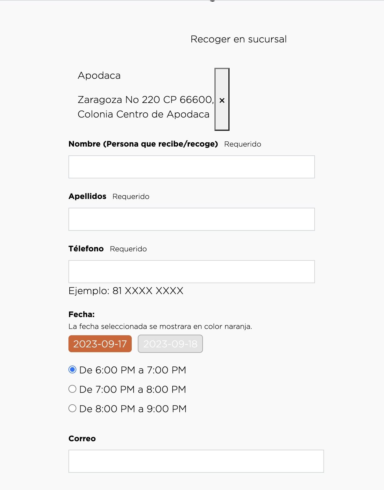

# Date Time Picker #

### Table Content ###
1. [Date Time JS](#date-time-js)

Date Time Picker is a custom functionality where we can define when can deliver the
customer order, we need different configurations to work with this customization.

### Date Time JS ###
we have a customized js file where we get the date selected by the user and show the times when the order can be delivered or picked up.
The file is located on _`app_custom_lety > cartridge > static > default > js`_

The `datetime.js` contains the main function with name `handleStoreHours()` and show the time that is available
in the shipping method using the `allSM`.

```javascript
  const handleStoreHours = (shippingMethodId = undefined) => {
    let timeForm = QS("#custom-store-hours");
    let allSM = JSON.parse(timeForm.getAttribute("data-store-hours"));
    let activeSM;
    if (shippingMethodId) {
      activeSM = { value: shippingMethodId };
    } else {
      activeSM = QS(".shipping-item-container input[type='radio'][checked]");
    }
    return allSM[activeSM.value] || allSM.default;
  };
```

This **allSM** call the attribute `data-store-hours` it contains a _JSON_ with the delivery hours and
pick up hours, each delivery method can have a different store hours, even if Pasteleria Lety wants another delivery method we can add it in the _JSON_ with different hours.
How we can define the store hours in the proyect?, we need to go into the business manager to define it
_`Merchant Tools > Site Preferences > Custom Preferences > deliveryStoreConfigs > Delivery Methods Schedule`_.

Here you can see a _JSON_ object with `delviery method`, `weekdays`, `open hours` and `close hours`, you can modify these values if you need to see more or less delivery hours.

```json
{
    "pickup": {
        "days": {
            "mon": {
                "openHours": 8,
                "closeHours": 21
            },
            "tue": {
                "openHours": 8,
                "closeHours": 21
            }
        },
        "daysToOrderAfterCurrentDay": 1
    },
    "standart": {
        "days": {
            "mon": {
                "openHours": 8,
                "closeHours": 22,
                "after": true
            },
            "tue": {
                "openHours": 8,
                "closeHours": 22,
                "after": true
            }
        },
        "daysToOrderAfterCurrentDay": 0
    }
}
```
